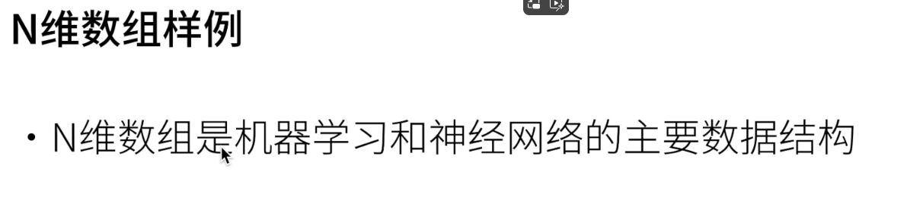
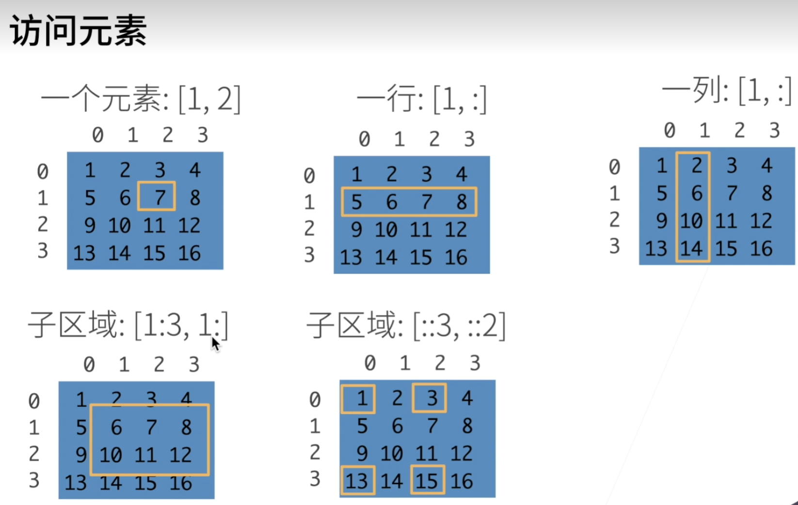

pytroch基础语法：

导入，生成张量

```
import torch
x = torch.arange(12) #生成0-12的向量
x
```

预期输出值：tensor([ 0,  1,  2,  3,  4,  5,  6,  7,  8,  9, 10, 11])

<br/>

<br/>

```
x.shape #查看向量形状
```

预期输出值：torch.Size([12])

<br/>

```
x.numel() #查看其中元素总数
```

预期输出值：12

<br/>

```
x = x.reshape(3,4) #改变形状 3行4列
x
```

预期输出值：tensor([[ 0,  1,  2,  3],
        [ 4,  5,  6,  7],
        [ 8,  9, 10, 11]])

<br/>

创建全零张量：

```
torch.zeros((2,3,4)) #创建全零

```

预期输出值：

tensor([[2, 1, 4],
        [1, 2, 3],
        [4, 5, 6],
        [7, 8, 9]])

<br/>

tensor基础运算：

```
#基础算术运算
x = torch.tensor([1.0, 2, 4, 8])
y = torch.tensor([2, 2, 2, 2])
x + y, x - y, x * y, x / y, x**y
```

预期输出值：

(tensor([ 3.,  4.,  6., 10.]),
 tensor([-1.,  0.,  2.,  6.]),
 tensor([ 2.,  4.,  8., 16.]),
 tensor([0.5000, 1.0000, 2.0000, 4.0000]),
 tensor([ 1.,  4., 16., 64.]))

<br/>

张量的合并：

```
X = torch.arange(12, dtype=torch.float32).reshape(3, 4) #生成向量，并指定float类型调整形状
print(X)
Y = torch.tensor([[2.0, 1, 4, 3], [1, 2, 3, 4], [4, 3, 2, 1]]) 

torch.cat((X, Y), dim=0), torch.cat((X, Y), dim=1) #cat合并x，y;并在dim(维度，按照第几个‘【’括号)第零位开始合并
```

预期输出值：

tensor([[ 0.,  1.,  2.,  3.],
        [ 4.,  5.,  6.,  7.],
        [ 8.,  9., 10., 11.]])
(tensor([[ 0.,  1.,  2.,  3.],
         [ 4.,  5.,  6.,  7.],
         [ 8.,  9., 10., 11.],
         [ 2.,  1.,  4.,  3.],
         [ 1.,  2.,  3.,  4.],
         [ 4.,  3.,  2.,  1.]]),
 tensor([[ 0.,  1.,  2.,  3.,  2.,  1.,  4.,  3.],
         [ 4.,  5.,  6.,  7.,  1.,  2.,  3.,  4.],
         [ 8.,  9., 10., 11.,  4.,  3.,  2.,  1.]]))

<br/>

张量逻辑运算：

```
X == Y #构建逻辑二元张量
```

预期输出值：

tensor([[False,  True, False,  True],
        [False, False, False, False],
        [False, False, False, False]])

<br/>

张量求和：

```
X.sum() #对一个张量求和
```

预期输出值：tensor(66.)

<br/>

张量的广播对齐：

```
a = torch.arange(3).reshape((3,1))
b = torch.arange(2).reshape((1,2))
a, b
```

预期输出值：

(tensor([[0],
         [1],
         [2]]),
 tensor([[0, 1]]))

<br/>

```
a + b #np带来的广播机制，将如”1“的数字复制为不同的向量相同维度使得可以运算
```

预期输出值：

tensor([[0, 1],
        [1, 2],
        [2, 3]])

<br/>

张量访问：

```
X[-1], X[1:3], X[1:], X[:2], X[0][0:3]
#d对元素访问“：”,左/右不写数字表示访问整行/列的最前/最后，带数字表示访问具体行/列到具体的多少行/列,-1表示最后一行,左闭右开
```

预期输出值：

(tensor([ 8.,  9., 10., 11.]),
 tensor([[ 4.,  5.,  9.,  7.],
         [ 8.,  9., 10., 11.]]),
 tensor([[ 4.,  5.,  9.,  7.],
         [ 8.,  9., 10., 11.]]),
 tensor([[0., 1., 2., 3.],
         [4., 5., 9., 7.]]),
 tensor([0., 1., 2.]))

<br/>

<br/>

```
X[1, 2] = 9 #指定索引写入
X
```

预期输出值：

tensor([[ 0.,  1.,  2.,  3.],
        [ 4.,  5.,  9.,  7.],
        [ 8.,  9., 10., 11.]])

<br/>

```
X [0:2, :] = 12 #指定索引写入
X
```

预期输出值：

tensor([[12., 12., 12., 12.],
        [12., 12., 12., 12.],
        [ 8.,  9., 10., 11.]])

<br/>

```
before = id(Y) #id类指针，表对象在内存中的标号
Y = Y + X
id(Y) == before #某些操作会导致重新分配内存
```

预期输出值：False

<br/>

```
Z = torch.zeros_like(Y)
print('id(Z):',id(Z))
Z[:] = X + Y
print('id(Z):', id(Z)) #原地操作，内存未改
```

预期输出值：

id(Z): 2075916493792
id(Z): 2075916493792

<br/>

```
before = id(X)
X += Y
id(X) == before

X [:] = X + Y

id(X) == before
#如果无重复使用X，可以用上面方法减少内存开销，直接用X += Y/X [:]，都是原地修改X通常不会创建新的对象
#使用Y = Y + X会创建新的新的序列来存储 Y 和 X 的合并结果
```

预期输出值：True

<br/>

```
A = X.numpy()
B = torch.tensor(A)
type(A), type(B) #numpy张量转换
```

预期输出值：(numpy.ndarray, torch.Tensor)

<br/>

```
a = torch.tensor([3.5])
a, a.item(), float(a), int(a) #.item()用于提取在只包含一个元素的tensor中的值
#将大小为1的张量转换为Python标量
```

预期输出值：(tensor([3.5000]), 3.5, 3.5, 3)

<br/>

数据导入及预处理：

```
#对于数据的操作
import os

os.makedirs(os.path.join('..', 'data'), exist_ok=True)

data_file = os.path.join('..', 'data', 'house_tiny.csv')

with open(data_file, 'w') as f:
    f.write('NumRooms,Alley,Price\n')#列名
    #数据
    f.write('NA, Pave, 1278\n')
    f.write('4, NA, 1781\n')
    f.write('NA, NA, 1400\n')
```

```
import pandas as pd

data = pd.read_csv(data_file)
print(data)
```

预期输出值： 

  NumRooms  Alley  Price
0       NaN   Pave   1278
1       4.0     NA   1781
2       NaN     NA   1400

<br/>

补全缺失值：

```
#补全数据，插值法和删除法
inputs, outputs = data.iloc[:, 0:2], data.iloc[:, 2] #分割为0、1列和2单独一列(iloc按照下标来查找)
print(outputs)
inputs = inputs.fillna(inputs.mean(numeric_only=True)) #替换有行内均值的nan
#补全法，设置numeric_only=True，告诉Pandas仅考虑数值类型的列来计算平均值。非数值列就会被自动排除在外，计算平均值时就不会遇到类型不兼容的错误了。
print(inputs)
```

预期输出值：

0    1278
1    1781
2    1400
Name: Price, dtype: int64
   NumRooms  Alley
0       4.0   Pave
1       4.0     NA
2       4.0     NA

<br/>

<br/>

```
#对于无法直接均值替换的用类别/离散值表示
#使用类别，视nan为一个类
import numpy
inputs = pd.get_dummies(inputs, dummy_na=True)
print(inputs)

inputs['Alley_ NA']=inputs['Alley_ NA'].astype(int)#将bool转int
inputs['Alley_ Pave']=inputs['Alley_ Pave'].astype(int)
inputs['Alley_nan']=inputs['Alley_nan'].astype(int)

print(inputs)
```

预期输出值：  

 NumRooms  Alley_ NA  Alley_ Pave  Alley_nan
0       4.0      False         True      False
1       4.0       True        False      False
2       4.0       True        False      False
   NumRooms  Alley_ NA  Alley_ Pave  Alley_nan
0       4.0          0            1          0
1       4.0          1            0          0
2       4.0          1            0          0

<br/>

补全后转化回张量

```
import torch
x, y = torch.tensor(inputs.values), torch.tensor(outputs.values)
x, y
#都为数值类型后转换为张量
```

预期输出值：

(tensor([[4., 0., 1., 0.],
         [4., 1., 0., 0.],
         [4., 1., 0., 0.]], dtype=torch.float64),
 tensor([1278, 1781, 1400]))
